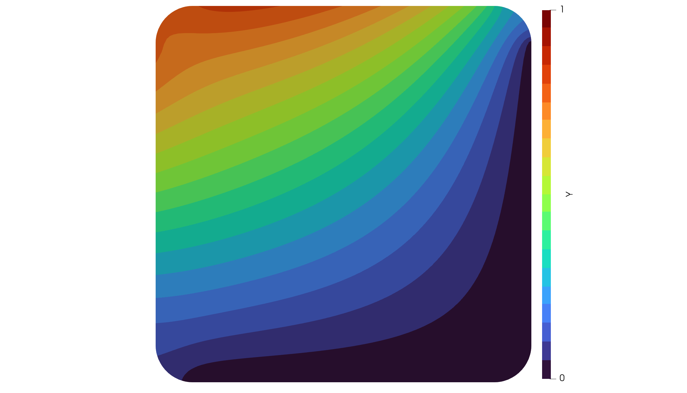

# A Boundary Source Problem

In the next example we concentrate on a boundary source term problem given by

```math
\begin{aligned}
-\Delta y = 0 &\quad \text{in}\; \Omega\\
y = 0 &\quad \text{on}\; \Gamma_0\\
\frac{\partial y}{\partial n} = f &\quad \text{on}\; \Gamma_s
\end{aligned}
```

where the boundary ``\Gamma = \Gamma_0 \cup \Gamma_s`` is assumed to be composed of two
disjoint parts.

Let ``V := \lbrace v \in H^1(\Omega):\, v\vert_{\Gamma_0} = 0\;\mathrm{a.e.} \rbrace``.
The variational formulation then reads as:

Find ``y \in V`` such that

```math
\int_{\Omega} \nabla y \cdot  \nabla v\, dx = \int_{\Gamma_s} f v \, ds
\quad \forall v \in V.
```

We now import a more interesting mesh and select the bottom and right boundary to
be ``\Gamma_0`` as well as the left and top boundary to be ``\Gamma_s`` by

```julia
using MinFEM
mesh = import_mesh("../meshes/rounded.msh")

freeBoundary = select_boundaries(mesh, 1003, 1004)
freeElements = extract_elements(freeBoundary)
dirichletBoundary = select_boundaries(mesh, 1001, 1002)
dirichletNodes = extract_nodes(dirichletBoundary)
```

The assembly of the stiffness matrix of the Laplacian is the same as for the plain
Poisson problem.
However, the mass matrix now has to discretize an integral over the boundary ``\Gamma_s``. 

```math
\int_{\Gamma_s} f v \, ds \quad \forall v \in V.
```

We thus call a different assembly routine, where we can specify the boundary elements
to be ``\Gamma_s``.
Note that, if no boundary elements would be specified, the method will assume
all physical boundaries of the mesh.

```julia
L = assemble_laplacian(mesh)
M = assemble_massmatrix_boundary(mesh, boundaryElements=freeElements)
```

Then we define an inline function `f`, which we want to evaluate at the boundary nodes
of ``\Gamma_s``:

```julia
f(x) = x[1]^2 + x[2]^2
s = evaluate_mesh_function(mesh, f, freeBoundary)
```

Notice that

```julia
length(s) == mesh.nnodes
```

although ``s`` is intend to be defined on the boundary only. Yet, it is more comfortable to
define ``s`` on all finite element nodes with 0 else than to keep track of
which value belongs to which node.

Finally, we assemble PDE, solve it and write the output to a file for Paraview:

```julia
pde = PDESystem(A=L, b=M*s, bc=zeros(mesh.nnodes), DI=dirichletNodes)
solve!(pde)

write_to_vtk([pde.state, s], mesh, ["Y","S"], "boundary_source")
```

In Paraview, the visualization should then look similar to the following:


