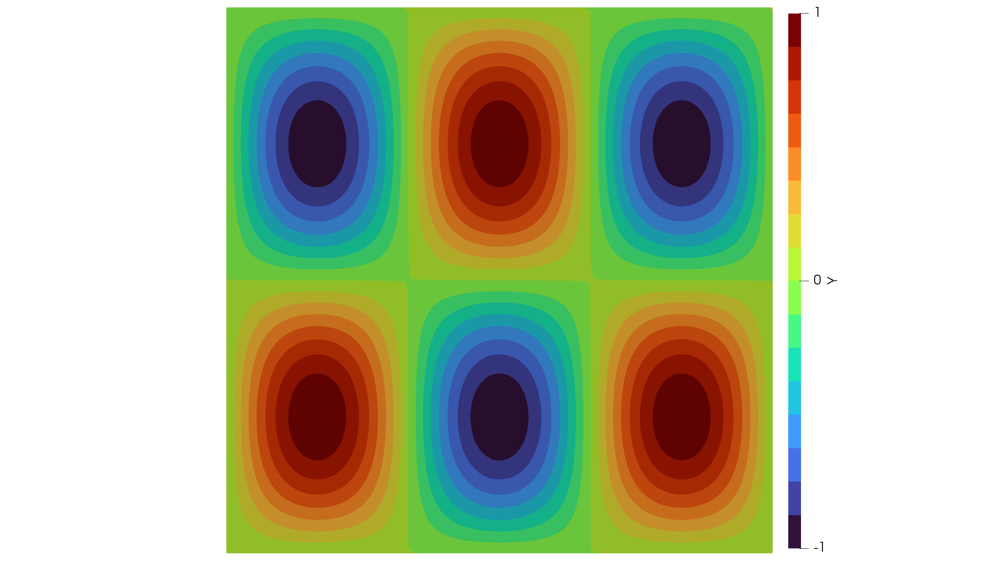

# A Poisson Problem

Lets go through a code for the Poisson equation on a unit square

```math
\Omega = (0,1)^2
```
and
```math
\Gamma = \partial \Omega
```
with homogeneous Dirichlet boundary conditions given by

```math
\begin{aligned}
-\Delta y = s &\quad \text{in}\; \Omega\\
y = 0 &\quad \text{on}\; \Gamma.
\end{aligned}
```

First we have to load the package MinFEM. We then import a mesh file generated with GMSH.
Here it is assumed that `square.msh` is located inside a `mesh/` folder in
the parent directory `../`.
This has to be adjusted if using Windows. 
Notice the line being commented out.
For simplicitity we could also generate a uniform mesh for the unit square ``(0,1)^2``
with, e.g., 30 nodes in each direction:

```julia
using MinFEMDev
mesh = import_mesh("../meshes/square.msh");
#mesh = unit_square(30);
```

```@setup poisson
using MinFEMDev
mesh = unit_square(30)
```

Now we can inspect the content of the new object:

```@example poisson
fieldnames(typeof(mesh))
```

Important for us is the field `Boundaries` assigning markers to the physical boundaries:

```@example poisson
keys(mesh.Boundaries)
```

We can thus see that there are four boundaries. The naming scheme (1001, 1002, 1003, 1004)
was more or less arbitrarily chosen during the creation of the mesh and could be changed.
Lets inspect one of them:

```@example poisson
fieldnames(typeof(mesh.Boundaries[1001]))
```

```@example poisson
mesh.Boundaries[1001]
```

The next step is to assemble the matrices which discretize the weak formulation:

Find ``y \in H_0^1(\Omega)`` such that

```math
\int_\Omega \nabla y \cdot \nabla v\, dx = \int_\Omega s v\, dx
```

for all ``v \in H_0^1(\Omega)``.

So we need a stiffness matrix

```@example poisson
L = assemble_laplacian(mesh)
```

and a mass matrix

```@example poisson
M = assemble_massmatrix(mesh)
```

We now want to set

```math
s_{m,n}(x) = \sin(n x_1 \pi)\,\sin(m x_2 \pi)
```

as an eigenfunction of the Laplacian multiplied with the corresponding eigenvalue

```math
\lambda_{m,n} = (n\pi)^2 + (m\pi)^2
```

```julia
n=3
m=2
f(x) = ((n*pi)^2 + (m*pi)^2) * sin(n*x[1]*pi) * sin(m*x[2]*pi)
s = evaluate_mesh_function(mesh, f)
```

Finally we plan to solve: Find ``y \in H_0^1(\Omega)`` such that

```math
\int_\Omega \nabla y \cdot \nabla v\, dx = \int_\Omega \lambda_{m,n} s_{m,n} v\, dx
```

for all ``v \in H_0^1(\Omega)``. Where we know that the exact, also classical solution,
is given by

```math
y(x) = s_{m,n}(x).
```

Therefore, we set up a `PDESystem` structure, which holds all necessary information
for the PDE.
These are the stiffness matrix, the load vector, Dirichlet values and
indices of the boundary nodes:

```julia
boundary = select_boundaries(mesh, 1001, 1002, 1003, 1004)
boundaryNodes = extract_nodes(boundary)

pde = PDESystem(A=L, b=M*s, bc=zeros(mesh.nnodes), DI=boundaryNodes)
```

Remember that the mesh was designed to have four physical boundaries identified
by the indices 1001-1004.

Finally, we solve the PDE and write the solution as well as the prescribed load
to a *.vtu*-file for visualization with Paraview:

```julia
solve!(pde)

write_to_vtk([pde.state, s], mesh, ["Y","S"], "poisson")
```

In Paraview, the visualization of the solution should then look similar to the following:


