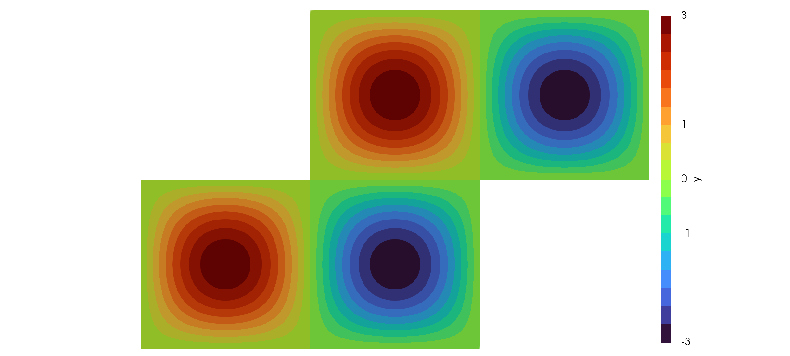

# A Semi-Linear Problem

In the following we discuss a non-linear example. The so-called standard, semilinear
PDE given by

```math
\begin{aligned}
-\Delta y + y^3 = f &\quad \text{in}\; \Omega\\
y = 0 &\quad \text{on}\; \Gamma.
\end{aligned}
```

The variational form reads as follows: Find ``y \in H_0^1(\Omega)`` such that

```math
\int_\Omega \nabla y \cdot \nabla v\, dx + \int_\Omega y^3  v\, dx = \int_\Omega f v\, dx
```

for all ``v \in H_0^1(\Omega)``.

Note that this is a non-linear equation in ``y``. In order to apply Newton's method we have
to differentiate with respect to ``y``.

The linearization evaluated in ``y`` in direction ``w`` is given by

```math
\int_\Omega \nabla w \cdot \nabla v\, dx + 3 \int_\Omega y^2 w v\, dx.
```

Consequently, one step of Newton's method is given by the solution of the variational
problem: Find ``w \in H^1_0(\Omega)`` such that

```math
\int_\Omega \nabla w \cdot \nabla v\, dx + 3 \int_\Omega y^2 w v\, dx =
-\int_\Omega \nabla y \cdot \nabla v\, dx - \int_\Omega y^3  v\, dx + \int_\Omega f v\, dx
```

for all ``v \in H_0^1(\Omega)``.

We thus introduce the function **assemble_cubicterm** and
**assemble_cubicderivativematrix** in order to assemble the source term involving ``y^3``
and the matrix with ``y^2``, respectively.

Most of the code is similar to the Poisson example. We thus illuminate what is required
additionally. The function `semilinear` evaluates Newton's method for the problem
described above with a tolerance `tol`:

```julia
using MinFEM, LinearAlgebra

function semilinear(mesh::Mesh, L::AbstractMatrix, M::AbstractMatrix,
                    s::AbstractVector, boundaryIndices::Set{Int64};
                    tol::Float64=1e-10, maxIterations::Int64=10)

    y = zeros(mesh.nnodes)

    pde = PDESystem(A=L, b=M*s, bc=zeros(mesh.nnodes), DI=boundaryIndices)

    for i = 1:maxIterations
        pde.A = L + assemble_cubicderivativematrix(mesh, y)
        pde.b = -L*y + M*s - assemble_cubicterm(mesh, y)
        refresh!(pde)
        solve!(pde)

        y += pde.state
        res = norm(pde.state)

        if res < tol
            println("It. $i: $res < $tol")
            println("Semi-linear routine converged.")
            break
        else
            println("It. $i: $res ≥ $tol")

            if i == maxIterations
                println("Semi-linear routine failed.")
                println("Maximum number of iterations reached.")
            end
        end
    end
    
    return y
end
```

The rest of the code is then similar to the Poisson problem:

```julia
mesh = import_mesh("../meshes/Zshaped.msh")

L = assemble_laplacian(mesh)
M = assemble_massmatrix(mesh)

f(x) = 3*2*pi^2*sin(x[1]*pi)*sin(x[2]*pi) + (3*sin(x[1]*pi)*sin(x[2]*pi))^3
s = evaluate_mesh_function(mesh, f)

boundary = select_boundaries(mesh)
boundaryNodes = extract_nodes(boundary)

y = semilinear(mesh, L, M, s, boundaryNodes)

write_to_vtk([y, s], mesh, ["y","s"], "semilinear")
```

In Paraview, the visualization should then look similar to the following:


