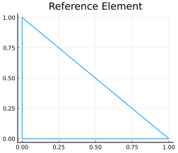
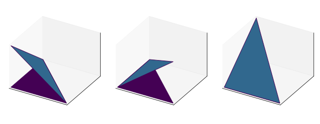
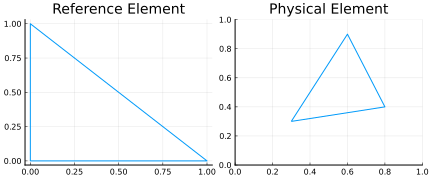

# A Closer Look on a Finite Element Code

This section is designed to give a small introduction to the implementation of a finite
element method, illustrated for 2 dimensions.

```@contents
Pages = ["fem.md"]
Depth = 3
```

```@setup fem
using MinFEM, Plots
path = "src/assets/fem/"
```

### The Reference Element

The first thing we will cover is the so-called reference element.
This is a prototypic element such that we later do not have to define everything for each
actual element, but can do it in a generic way.
MinFEM uses tetrahedral elements and the reference element is thus
given by the ``d``-dimensional standard simplex

```math
T = \left\lbrace x \in [0,1]^d:\, \sum_{j=1}^d x_j \leq 1\right\rbrace.
```

For this guide, we will work mostly in 2D, where this is simply the reference triangle

```math
T = \lbrace x \in [0,1]^2:\, x_1+x_2 \leq 1\rbrace.
```



### Local Basis Functions on ``T``

On ``T`` we can define order ``p=1`` Lagrange Polynomials

```math
\phi: T \to \mathbb{R}
```

using the vertices ``v_l, l=1,...,d+1`` as nodes such that

```math
\phi_l(v_{l^\prime}) = \delta_{l,l^\prime}
```

we obtain the basis functions

```math
\phi_l(x) = \begin{cases}
    1 - \sum_{j=1}^d x_j & \text{if } l = 1\\
    x_{l-1} & \text{else}
\end{cases}
```

in 2 dimension looking the following:



### The Global Basis Functions

On a patch of, e.g., five physical triangles we then have a global basis function 
``\Phi_i: \Omega \to \mathbb{R}`` of the following form:


Since with each node ``x_i`` in the mesh one global basis function ``\Phi_i`` is associated
we have the property

```math
\Phi_i(x_j) = \delta_{i,j}.
```

### Quadrature Nodes on Triangles

The next step is to define some quadrature nodes with weights on ``T``.
In principle, every set of distinct nodes with appropriate weights can be used for 
quadrature. 
Here we use a tensorproduct Gauss formula,
since for these types the approximation order is known.


The presented quadrature rule allows exact integration of polynomials of order up to p=3.

### Using Quadrature Formulas

In principle, we could integrate terms like 

```math
\Phi_i \Phi_j
```

or 

```math
\nabla \Phi_i \cdot \nabla \Phi_j
```

analytically since we only consider ``p=1`` Lagrange elements.

It is yet convenient to use quadrature formulas for, e.g., a nonlinear source term.

### Mapping Reference to Physical Elements

In order to integrate over a physical triangle in the mesh ``T_k``,
we need to establish a mapping between ``T_k`` and the reference element ``T`` via a
function

```math
\psi_k: T \to T_k.
```



### Integration Over the Reference Element via Transformation Formula

For linear finite elements with the chosen reference element ``T`` we can map each point
``r \in T`` to a ``x \in T_k`` by the affine mapping

```math
x = \psi_k(r) = J_k r + b_k.
```

Here ``J_k \in \mathbb{R}^{2\times 2}`` and ``b_k\in \mathbb{R}^2`` is constant for each
triangle.


Further, let ``w_1, w_2, w_3`` be the vertices of the triangle ``T_k``.
The matrix ``J_k`` is then given by

```math
J_k = [w_2 - w_1 \vert w_3 - w_1] \quad \text{and} \quad b_k = w_1.
```

Integration of a function ``f \in L^1(T_k)`` over ``T_k`` is thus performed by integration
over ``T`` as

```math
\begin{aligned}
\int_{T_k} f(x) dx &= \int_{T} f(\psi_k(x))\, \vert\det(D\psi_k(x))\vert \, dx\\
&= \int_{T} f(\psi_k(x))  \, \vert\det(J_k)\vert \, dx.
\end{aligned}
```

By ensuring that in all physical elements ``T_k`` the node numbering is counter clockwise,
like in the reference element ``T``, it follows ``\det(J_k) \geq 0``
and we can omit the modulus.
Moreover, as long as ``T_k`` is not degenerated it follows ``\det(J_k) > 0``.

### Mapping From Local to Global Nodes

For every finite element code the mapping from local nodes in each triangle to the
corresponding global node numbers is essential.

Let the mesh be given by the triangles ``\lbrace T_1,\dots, T_K\rbrace`` and
a number of ``N`` nodes and thus the global basis functions.

For this mesh we assume a given map 

```math
\eta:\lbrace 1, \dots, K\rbrace \times \lbrace1,2,3\rbrace \to \lbrace 1, \dots, N\rbrace,
\; \eta(k,l) = i
```

which assigns the ``l``-th node in the ``k``-th triangle the corresponding
global node ``i``.

```math
\Phi_i: \Omega \to \mathbb{R},\; i=1,\dots,N.
```

Further observe that

```math
\mathrm{spt}(\Phi_i) \subset \lbrace T_1,\dots, T_K\rbrace.
```

More precisely

```math
\mathrm{spt}(\Phi_i) = \lbrace T_k: \exists (k,l) \in \lbrace 1, \dots, K\rbrace \times
\lbrace1,2,3\rbrace\; \text{with}\; \eta(k,l) = i \rbrace
```

### Link Between Global and Local Basis Functions

Let the global basis function ``\Phi_i:\Omega \to \mathbb{R}`` be associated with
the node ``i``.

We then have the property that

```math
\Phi_i (x) = \phi_l(\psi^{-1}_k(x))\quad \forall\, x\in T_k.
```

provided that ``\eta(k,l) = i``.

Thus, we can use the following relation for integration on physical elements

```math
\Phi_i(\psi_k(x)) = \phi_{l}(x) \quad \forall \, x \in T.
```

### Mass Matrix Assembly

Recall that one entry of the mass matrix is given by

```math
\begin{aligned}
M_{i,j} &= \int_{\Omega} \Phi_i(x) \Phi_j(x)\, dx\\
        &= \sum_{k=1}^K \int_{T_k} \Phi_i(x) \Phi_j(x)\, dx\\
        &= \sum_{k=1}^K \int_{T_k} \phi_l(\psi^{-1}_k(x)) \phi_h(\psi^{-1}_k(x))\, dx\\
        &= \sum_{k=1}^K \int_{T} \phi_l(x) \phi_h(x) \vert \mathrm{det}(J_k)\vert\, dx
\end{aligned}
```

provided that ``\eta(k,l) = i`` and ``\eta(k,h) = j``.
In principal, the sum above involves many vanishing summands. It is sufficient to
sum over all ``T_k \in \mathrm{spt}(\Phi_i) \cap \mathrm{spt}(\Phi_j)``.

In order to assemble this matrix for ``1\leq i,j \leq N`` it is algorithmically more
efficient to iterate over triangles rather than iterating over global basis functions
by ``i`` and ``j``.

We thus compute the following

```math
M_{n(k,l), n(k,h)} \gets M_{n(k,l), n(k,h)} + \int_{T} \phi_l(x) \phi_h(x)
    \vert \mathrm{det}(J_k)\vert\, dx \quad \forall\, (k,h,l)
    \in \lbrace1,\dots,K\rbrace\times \lbrace 1,2,3 \rbrace^2
```

This saves us the computational effort to find out which ``T_k`` is
in ``\mathrm{spt}(\Phi_i) \cap \mathrm{spt}(\Phi_j)``.

### Treatment of Terms With Derivatives

In the following we understand derivatives as row vectors

```math
D \phi = (\partial_1 \phi, \partial_2 \phi)
```

and the Jacobian matrix of a vector valued function, e.g. the element transformation, as

```math
D \psi = 
\begin{pmatrix}
\partial_1 \psi_1 & \partial_2 \psi_1\\
\partial_1 \psi_2 & \partial_2 \psi_2
\end{pmatrix}.
```

For terms which involve gradients we first observe that

```math
D \Phi_i(x) = D \phi_l(\psi_k^{-1}(x)) D \psi_k^{-1} =
D \phi_l(\psi_k^{-1}(x)) J_k^{-1}\quad \forall\, x\in T_k
```

provided that ``\eta(k,l) = i``.
And thus

```math
D \Phi_i(\psi_k(x)) = D \phi_l(x) J_k^{-1}\quad \forall \, x \in T.
```

Due to the fact that we only consider piece-wise linear basis functions we obtain

```math
D \Phi_i = D\phi_l J_k^{-1}.
```

### Towards the Stiffness Matrix for the Laplacian

Recall that the stiffness matrix for the Laplacian is defined as

```math
L_{i,j} = \int_{\Omega} D \Phi_i(x) \cdot D \Phi_j(x)\, dx =
\int_{\Omega} D \Phi_i \cdot D \Phi_j\, dx.
```

Following the same argumentation as for the mass matrix,
the stiffness matrix can be computed by

```math
L_{n(k,l), n(k,h)} \gets L_{n(k,l), n(k,h)} +
\int_{T} (D \phi_l J_k^{-1}) \cdot (D \phi_h J_k^{-1})\,
\vert \mathrm{det}(J_k)\vert\, dx\\ \forall\, (k,h,l) \in
\lbrace1,\dots,K\rbrace\times \lbrace 1,2,3 \rbrace^2.
```

The general structure of a code, which assembles stiffness or mass matrix, is based on
three nested loops. The outermost loop iterates over all triangles, then one loop over
three basis functions and the innermost loop iterates over three test functions.

### Example Calculation for the Stiffness Matrix

Consider the following domain as ``\Omega``


As an example we assume piece-wise linear basis functions and compute one entry of the
stiffness matrix of the Laplacian

```math
L_{1,3} = \int_\Omega D \Phi_1 \cdot D \Phi_3\, dx
```

which corresponds to the basis function ``\Phi_1`` located in ``w_1``
and ``\Phi_3`` in ``w_3``.

Inspecting the support of ``D \Phi_1 \cdot D \Phi_3`` we see that

```math
L_{1,3} = \int_{T_1} D \Phi_1 \cdot D \Phi_3\, dx + \int_{T_4} D \Phi_1 \cdot D \Phi_3\, dx.
```

Let the transformation function for ``T_1`` be given by ``\psi_1: T \to T_1`` such that
``\psi_1(v_1) = w_1, \psi_1(v_2) = w_2, \psi_3(v_3) = w_3`` as sketched below


Thus, we obtain

```math
\Psi_1(v) = J_1 v + w_1, \quad J_1 = [w_2 - w_1 \vert w_3 - w_1] =
\begin{pmatrix} a & \frac{a}{2}\\ 0 & \frac{b}{2} \end{pmatrix}.
```

For the triangle ``T_4`` we obtain similarly by choosing 
``\psi_4(v_1) = w_4, \psi_4(v_2) = w_1, \psi_4(v_3) = w_3`` that

```math
\Psi_4(v) = J_4 v + w_4, \quad J_4 = [w_1 - w_4 \vert w_3 - w_4] =
\begin{pmatrix} 0 & \frac{a}{2}\\ -b & -\frac{b}{2} \end{pmatrix}.
```

Recall the mapping ``\eta(l,i) \in \lbrace 1,2,3 \rbrace`` which assigns the global node
number ``i`` to the local node number ``\eta(l,i)`` in the ``l``-th triangle.
Using this notation we obtain ``\eta(1,3) = 3, \eta(1,1) = 1``
and ``\eta(4,3) = 3, \eta(4,1) = 2``.
Further, recall that local basis functions ``\phi_n: T \to \mathbb{R}`` are chosen as

```math
\phi_n (v_j) = \delta_{nj}, \quad 1\leq n,j \leq 3
```

such that we obtain

```math
D \phi_1 = (-1,-1),\; D \phi_2 = (1,0),\; D \phi_3 = (0,1).
```

We also compute

```math
J_1^{-1} = \frac{2}{ab} \begin{pmatrix} \frac{b}{2} & -\frac{a}{2}\\ 0 & a \end{pmatrix}
\quad \text{and} \quad \mathrm{det}(J_1) = \frac{ab}{2}
```

```math
J_4^{-1} = \frac{2}{ab} \begin{pmatrix} -\frac{b}{2} & -\frac{a}{2}\\ b & 0 \end{pmatrix}
\quad \text{and} \quad \mathrm{det}(J_4) = \frac{ab}{2}.
```

We can thus conclude

```math
\int_{T_1} D \Phi_1 \cdot D \Phi_3\, dx = \int_{T} (D \phi_1  J^{-1}_1) \cdot
(D \phi_3 J^{-1}_1)\, \vert \mathrm{det}(J_1)\vert dx = - \frac{a}{2b}
```

and

```math
\int_{T_4} D \Phi_1 \cdot D \Phi_3\, dx = \int_{T} (D \phi_2 J^{-1}_4) \cdot
(D \phi_3 J^{-1}_4)\, \vert \mathrm{det}(J_4)\vert dx = - \frac{b}{2a}
```

which results in 

```math
L_{1,3} = \int_{T_1} D \Phi_1 \cdot D \Phi_3\, dx + \int_{T_4} D \Phi_1 \cdot
D \Phi_3\, dx = - \frac{a}{2b} - \frac{b}{2a}.
```
