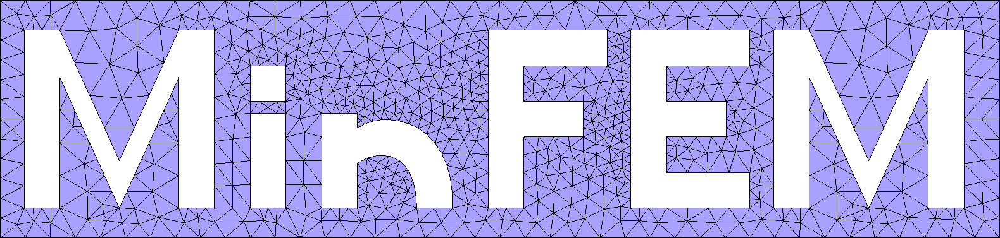

# MinFEM.jl
*A minimal finite element tool for demonstration and teaching.*

### Package Features

- Linear Lagrange basis functions.
- Support for isoparametric tetrahedral grids in 1D, 2D and 3D.
- Import of meshes from GMSH in formats v1, v2 and v4.
- Output in *.vtu*-format for Paraview or simple *.txt*.
- Several illustrative demonstration problems.
- Extensive documentation.

### Introduction

The package aims to provide an easy and minimalistic introduction 
to the finite element method.
This documentation is designed to enable you to quickly code, solve and visualize
your first own finite element problems in julia, without preliminary knowledge required.

We start by a brief introduction to the theoretical construction of finite elements,
basis functions and operator assembly in the section [The Finite Element Method](fem.md).
Then the [Getting Started](gettingstarted.md) page explains how to start
using MinFEM in julia and code an easy example.
Subsequently, we show how to use basic features of the industrial-grade application
Paraview to display your obtained results on the [Visualization](paraview.md) page.

Finally, the **Examples** section features some detailed demonstrations
for different types of problems that can be solved using a finite element approach,
where the original code files are in addition available in the 
[GitHub repository](https://github.com/MinFEM/MinFEM.jl/tree/master/examples).

```@contents
Pages = [
    "examples/poisson.md",
    "examples/boundary_source.md",
    "examples/elasticity.md",
    "examples/semilinear.md",
    "examples/parabolic.md"
]
Depth = 1
```

For more experienced users, we further offer the **Library** with a full list of types,
functions and methods provided by MinFEM featuring explicit documentation.
This also includes extensions of the finite element method not used for the tutorials
showed in this documentation.

```@contents
Pages = ["lib/public.md", "lib/internal.md"]
Depth = 1
```
