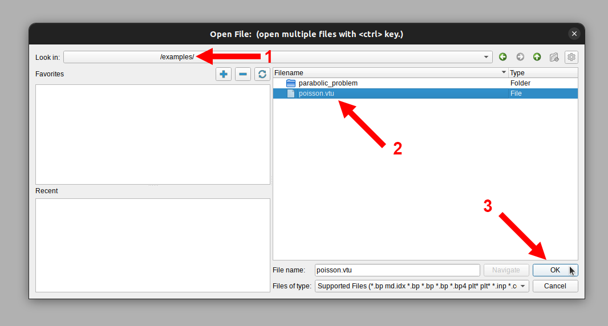

# Visualization with Paraview

MinFEM is designed to output files in *.vtu*-format in order to visualize
them with Paraview, which is an industry-standard open-source application.
While it might be beneficial for the future to have experience with such a tool,
on the other hand it also offers some simple-to-use features you can utilize to generate
(colorful) images of your work.
Therefore, this page will give you a short walk-through for the basic features of Paraview.

The application itself can be obtained for all common operating systems from the official
[website](https://www.paraview.org/download/), where you can also find more detailed
tutorials.
We recommend to choose the latest stable version or optionally, for already
experienced users, if you want to generate truly non-rasterized *.svg*-files,
a 4.x version.

### Open a File

Assume you already created a *.vtu*-file, e.g by solving one of our example problems.
If not please proceed with that, e.g. [Geting Started](gettingstarted.md), and then
return here later.

When opening the Paraview GUI, it should look similar to the following image,
where you can click on the button in the top left corner to open the file
selection dialog.

Now navigate to the desired *.vtu*-file, select it and click on OK.
If you want to open multiple files, you can also do so by holding the ctrl-key and
select on multiple files.

After opening a file it will appear in the pipeline browser on the left,
but will not be active yet.
To activate it, make sure the file is selected in the browser and
hit the green apply button.
While this procedure feels a little unhandy for our purpose here, for larger files it
becomes important to customize properties a priori. 

After applying the file, your main window will show a grey surface with the shape of your
domain.
To view the computed solution you need to change the coloring to the dataset, which can be
done via the dropdown menu at the top **or** in the properties below the pipeline browser.
If you wrote multiple datasets to the file, e.g. also a source term, you can also switch
between them and compare them.

In the end, your GUI might look the following image.
Note that the actual look depends on your color mapping,
which can be can be changed via the button with the folder and the heart on the right.
There you can choose from a range of different presets.
Further, it is often more useful to see level sets instead of a continuous coloring.
In order to reach that, simply reduce the number of table values in the lower right corner.

### Export a Screenshot

After you visualized your solution, you might also want to share it, for example in
a presentation.
Since you do not want to open Paraview all the time, you can export the current scene,
i.e. the blue framed center element, as a screenshot.
Therefore hit the respective button on top.

This will open a file dialog, where you can specify a path and the name, your
screenshot shall be saved under. Confirm by clicking OK.

Next, there is a dialog for options. You do not have to change anything her, however it
often comes in handy, to make the background transparent by checking the respective box.
Further, the initial resolution depends on your display and should often be increased.
The easiest ways to do so are by clicking on the x button and then select x2 in the
dropdown or use the lock button to fix the ratio and then change one number manually.
Finally, save the screenshot by hitting OK.

### Open a Sequence

Sometimes you do not want to open just a single file, but e.g. all the files for a time
sequence or intermediate results of an iterative process.
Enter the file dialog the same way, you did for a single file.
Paraview automatically groups files, that have a similar name, e.g. with a running index
at the end numbering the time steps.
So already keep this in mind, when generating and naming your files.
Select the (multi-)file and hit OK.

Proceed the like for a single file. 
Apply it in the pipeline and change the coloring to the intended dataset.
For a sequence of files, you now additionally want to fit the scale to all time steps.
Otherwise it is just based on the first frame
and you might end up seeing no change in time.
Therefore, click the respective button in the top menu.

Since this procedure could take very long for large datasets, you will get a warning.
However, this should not be relevant for your use cases and thus confirm it.
After that, you might see that the scale in the main window has changed. 

Now you can start the (time) animation by clicking the play button in the controls
at the top of the window.
This will run the animation once for all time steps.
Of course, you can also skip to the beginning and the end, click through single frames
or loop the animation.

### Export an Animation

Similar to exporting a single screenshot, you can also directly export a sequence of
screenshots for all steps.
Therefore, access the save animation option via the file menu in the top left corner.
This will open the same dialogs as for the single screenshot, so proceed as before.
In the end you will end up, with a file for each time step,
where the name is appended by a running index, so you might consider saving them to a
separate folder.
Later, you could externally generate a video or a gif from those images.

